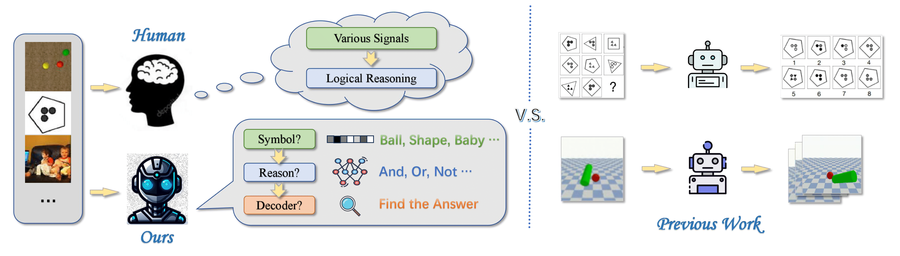

<br>
<p align="center">
<h1 align="center"><strong>Two Stage Visual Reasoning</strong></h1>
  <p align="center">
  	<strong>ECCV 2024</strong>
	<br>
    <a href='https://mybearyzhang.github.io//' target='_blank'>Mingyu Zhang*</a>&emsp;
	<a href='https://Caijiting.github.io' target='_blank'>Jiting Cai*</a>&emsp;
    <a href='https://mingyulau.github.io/' target='_blank'>Mingyu Liu</a>&emsp;
    <a href='https://silicx.github.io/' target='_blank'>Yue Xu</a>&emsp;
	<a href='https://www.mvig.org' target='_blank'>Cewu Lu</a>&emsp;
    <a href='https://dirtyharrylyl.github.io/' target='_blank'>Yong-Lu Li</a>&emsp;
    <br>
    Shanghai Jiao Tong University&emsp;Zhejiang University
    <br>
  </p>
</p>


<div id="top" align="center">

[](https://arxiv.org/abs/2407.19666)
[]((https://arxiv.org/pdf/2407.19666))
[](https://mybearyzhang.github.io/projects/TwoStageReason/)

</div>


## 🏠 Background


<!-- <div style="text-align: center;">
    
</div> -->

Through rigorous evaluation of diverse benchmarks, we demonstrate the shortcomings of existing ad-hoc methods in achieving cross-domain reasoning and their tendency to data bias fitting. In this paper, we revisit visual reasoning with a two-stage perspective: (1) symbolization and (2) logical reasoning given symbols or their representations. We find that the reasoning stage is better at generalization than symbolization. Thus, it is more efficient to implement symbolization via **separated** encoders for different data domains while using a **shared** reasoner.

<!-- ## 📜 Abstract

Visual reasoning is a fundamental task in computer vision, which aims to infer the relationship between objects in an image. Existing methods usually adopt an end-to-end manner to solve this task, which may lead to data bias fitting and poor generalization. In this paper, we propose a two-stage visual reasoning framework, which consists of a symbolization stage and a reasoning stage. The symbolization stage is responsible for encoding the input image into symbols, while the reasoning stage is responsible for inferring the relationship between symbols. We find that the reasoning stage is better at generalization than the symbolization stage. Thus, it is more efficient to implement symbolization via separated encoders for different data domains while using a shared reasoner. We conduct extensive experiments on three visual reasoning benchmarks, including CLEVR, CLEVR-Humans, and GQA. The results show that our method outperforms existing methods by a large margin. We also demonstrate the effectiveness of our method in cross-domain reasoning and data bias fitting. -->

## 📦 Installation

```bash
git clone https://github.com/mybearyZhang/TwoStageReason.git
cd TwoStageReason
pip install -r requirements.txt
```

## 🚀 Quick Start

## Single task training

To run the task, please run

`python train.py -c config/config_raven.json [-r saved/models/sota-RAVEN/mmdd_hhmmss/model_best.pth] [-d 0,1,2,3]`

+ `-c` to configurate the settings of the training task
+ `-r` to resume pretrained model (*optional*)
+ `-d` to assign device (*optional*)

## Multiple tasks training

To run the task, please run

`python cotrain.py -c config/raven_cvr_svrt.json. [-r saved/models/raven_opt/resumed_model.pth] [-d 0,1,2,3]`

+ `-c` to configurate the settings of the training task
+ `-r` to resume pretrained model (*optional*)
+ `-d` to assign device (*optional*)
  
## Single task testing

To test the trained model, please run

`python test.py -c config/config_raven.json [-r saved/models/sota-RAVEN/mmdd_hhmmss/model_best.pth]`

+ `-c` to configurate the settings of the training task
+ `-r` to resume pretrained model (*optional*)
+ `-d` to assign device (*optional*)

## Multiple tasks testing

To test the trained model, please run

`python cotest.py -c config/raven_cvr_svrt.json -r saved/models/RAVEN-CVR-SVRT/mmdd_hhmmss/checkpoint-epoch50.pth -d 3,4,5,7`

+ `-c` to configurate the settings of the training task
+ `-r` to resume pretrained model (*optional*)
+ `-d` to assign device (*optional*)

<!-- ## 📊 Results

### CLEVR

| Model | Acc |
| --- | --- |
| Baseline | 98.0 |
| TwoStageReason | 99.0 |

### CLEVR-Humans

| Model | Acc |
| --- | --- |
| Baseline | 98.0 |
| TwoStageReason | 99.0 |

### GQA

| Model | Acc |
| --- | --- |
| Baseline | 98.0 |
| TwoStageReason | 99.0 | -->

## 📝 Citation

If you find our work useful in your research, please consider citing:

```bibtex
@article{zhang2024take,
  title={Take A Step Back: Rethinking the Two Stages in Visual Reasoning},
  author={Zhang, Mingyu and Cai, Jiting and Liu, Mingyu and Xu, Yue and Lu, Cewu and Li, Yong-Lu},
  journal={arXiv preprint arXiv:2407.19666},
  year={2024}
}
```


<!-- ## 📦 Benchmark and Model
### Benchmark Overview
<p align="center">
  
</p>


<p align="center">
  
</p> -->


<!-- ## 📝 TODO List

- \[x\] First Release.
- [ ] Update code for ad-hoc training.
- [ ] Update code for our two-stage training. -->

<!-- ## 👏 Acknowledgements -->

